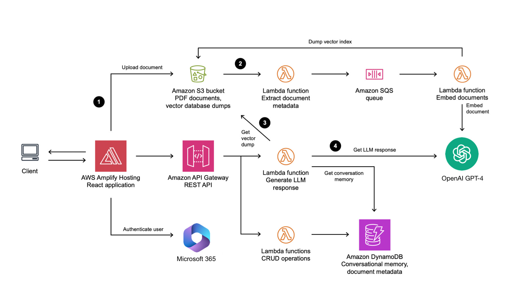

# Dawson-Project-
GPT for Dawson Group that harnesses Generative AI for information retrieval. 

## Key features

- [OpenAI](https://openai.com/) for serverless embedding and inference
- [LangChain](https://github.com/hwchase17/langchain) to orchestrate a Q&A LLM chain
- [FAISS](https://github.com/facebookresearch/faiss) vector store
- [Amazon DynamoDB](https://aws.amazon.com/dynamodb/) for serverless conversational memory
- [AWS Lambda](https://aws.amazon.com/lambda/) for serverless compute
- Frontend built in [React](https://react.dev/), [TypeScript](https://www.typescriptlang.org/), [TailwindCSS](https://tailwindcss.com/), and [Vite](https://vitejs.dev/).
- Run locally or deploy to [AWS Amplify Hosting](https://aws.amazon.com/amplify/hosting/)
- [Amazon Cognito](https://aws.amazon.com/cognito/) for authentication

## How the application works

1. A user uploads a PDF document into an [Amazon Simple Storage Service](https://aws.amazon.com/s3/) (S3) bucket through a static web application frontend.
1. This upload triggers a metadata extraction and document embedding process. The process converts the text in the document into vectors. The vectors are loaded into a vector index and stored in S3 for later use.
1. When a user chats with a PDF document and sends a prompt to the backend, a Lambda function retrieves the index from S3 and searches for information related to the prompt.
1. A LLM then uses the results of this vector search, previous messages in the conversation, and its general-purpose capabilities to formulate a response to the user.

## Deployment instructions

### Prerequisites

- [AWS SAM CLI](https://docs.aws.amazon.com/serverless-application-model/latest/developerguide/install-sam-cli.html)
- [Python](https://www.python.org/) 3.11 or greater

## License

This library is licensed under the MIT-0 License. See the [LICENSE](LICENSE) file.
